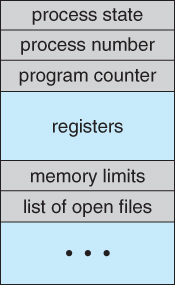

# Processes and Threads
## Processes
Process หมายถึง โปรแกรมที่กำลังจะถูกประมวลผล หรือ กำลังประมวลผลอยู่

### Process Concept
Process มีแนวคิดง่ายๆ ก็คือ โปรแกรมที่กำลังประมวลผลอยู่นั้นจะดำเนินไปเป็นลำดับ ซึ่ง process memory จะแบ่งออกเป็น 4 ส่วน คือ
1. Text คือ ส่วนที่ใช้ในการคอมไฟล์โปรแกรม หรือ อ่านโปรแกรมจาก non-volatile storage ตอนที่โปรแกรมเริ่มทำงาน
2. Data คือ ส่วนที่เก็บรักษาข้อมูลต่างๆไว้
3. Heap คือ ส่วนที่ใช้กับ dynamic memory allocation และจัดการกับการ call function new, delete, malloc and , etc.
4. Stack คือ ส่วนที่ใช้ในการจัดเก็บค่าของ local variables ซึ่งพื้นที่ที่ใช้จัดเก็บค่าจำพวกนี้จะถูกปล่อยทันทีที่ค่าที่เราเก็บนั้นหลุดออกจาก scope ไป
  

### Process State
ในแต่ละ process จะทำการประมวลผลตามลำดับการทำงาน หรือ สถานะระหว่างการเกิด process จน process นั้นจบลงที่เราเรียกกันว่า process state ซึ่งประกอบไปด้วย 5 ส่วนหลักๆ ได้แก่
1. New คือ การเริ่มต้น process ใหม่โดยการจอง memory ไว้
2. Ready คือ การรอชุดคำสั่งที่จะนำไปประมวลผลจาก processor
3. Running คือ กำลังประมวลผลชุดคำสั่งอยู่
4. Waiting คือ การรอให้ชุดคำสั่งอื่นเกิดขึ้นก่อน
5. Terminated คือ การที่โปรแกรมประมวลผลเสร็จเรียบร้อยแล้ว
    

จากภาพจะอธิบายขั้นตอนการทำงานเพิ่มเติมได้ว่า
1. เริ่มต้นจากการสร้าง new process เพื่อการจอง memory
2. เมื่อสร้างสำเร็จแล้วก็จะนำ process นั้นเข้าไปไว้ในคิวแล้วเปลี่ยนสถานะให้เป็น ready
3. เมื่อ process ถูกนำจากคิวเข้าไปประมวลผลบน CPU ก็จะเปลี่ยนสถานะจาก ready เป็น running
4. บาง process อาจมีคำสั่งให้รอบางอย่างก่อน process ที่ต้องรอจะเปลี่ยนสถานะต้นเองเป็น waiting และจะเปลี่ยนสถานะกลับไปเป็น ready เมื่อได้สิ่งที่ต้องการแล้ว
5. เมื่อ process ถูกประมวลผลครบทุกคำสั่งแล้ว process นั้นก็จะสิ้นสุดลงพร้อมเปลี่ยนสถานะเป็น terminated
    
### Process Control Block
ในแต่ละ process จะมี Process Control Block หรือ PCB อยู่ซึ่งเจ้าตัว PCB นี่จะทำหน้าที่ในการเก็บค่าต่างๆ ดังนี้
1. Process state คือ state ที่อธิบายไปก่อนหน้าซึ่งประกอบไปด้วย new, ready, running, waiting และ terminated
2. Process ID and parent process ID คือ ค่าที่เป็นเหมือนกับรหัสประจำตัวของแต่ละ process
3. CPU registers and Program Counter คือ ส่วนที่จำเป็นสำหรับการเก็บ หรือ การกู้คืนข้อมูลในการสับเปลี่ยน processes เข้า-ออก CPU
4. CPU-Scheduling information คือ ลำดับของข้อมูล และ ตำแหน่งของข้อมูลที่อยู่ในคิว ใช้ในการบ่งบอกว่าข้อมูลไหนจะถูกอ่านก่อนหรือหลัง
5. Memory-Management information เช่น page tables หรือ segment tables
6. Accounting information เช่น user CPU เวลาที่ใช้ หรือหมายเลขต่างๆ และอื่นๆ
7. I/O Status information คือ การจัดสรรข้อมูล เช่น การเปิดอ่านไฟล์ หรือ การแก้ไขไฟล์ใหม่
  

  
## Threads
Threads หมายถึง หน่วยทำงานย่อยที่สามารถทำให้ process อันหนึ่งสามารถมีหลายๆ Threads เพื่อที่จะประมวลผลการทำงานไปพร้อมๆกันได้ ซึ่งการที่สามารถทำแบบนี้ได้ในปัจจุบันนั้นเพราะว่ามีการดึงประสิทิภาพของ multi CPU มาใช้งานแบ่งให้แต่ละ core ประมวลผลแต่ละ thread ไปพร้อมๆกัน ซึ่งในเธรดนั้นประกอบไปด้วย 
1. Thread ID คือ รหัสประจำตัวเธรดที่อยู่ใน process
2. Counter คือ ตัวนับลำดับของคำสั่งที่จะถูกประมวลผลตัวถัดไป
3. Register คือ หน่วยความจำเก็บค่าตัวแปรต่างๆที่กำลังทำงานอยู่ในปัจจุบัน
4. Stack คือ ส่วนที่ใช้ในการเก็บประวัติการทำงานต่างๆ
  
### Single thread vs Multithread
จากการเทียบการทำงานระหว่าง Single thread กับ Multithread นั้น Multithread จะมีประสิทธิภาพมากกว่า เพราะ ทำให้งานย่อยๆ หรือ แต่ละ threads นั้นทำงานไปพร้อมๆกัน ประสานจังหวะในการทำงานและการใช้ทรัพยากรร่วมกันเพื่อให้เกิดการทำงานที่มีประสิทธธิภาพมากที่สุดได้
  
### Multithreading Models
#### One-to-One
การจับคู่ทำงานระหว่าง user thread ไป kernel threads ซึ่งทำให้สามารถประมวลผลไปหลายๆ thread พร้อมกันได้ แต่มีปัญหาตรงที่ต้องมี kernel threads ที่รองรับเพียงพอ
#### Many-to-One
การที่ user threads หลายๆอันวิ่งไปที่ kernel thread เพียงอันเดียวซึ่งวิธีนี้จัดการพื้นที่ของ user ได้ค่อนข้างดี แต่จะมีปัญหาตรงที่ สามารถรันได้เพียงแค่ที่ละ 1 thread เท่านั้นเพราะ ระบบ thread blocking จะทำการ block process ที่มีมากเกินไปในแต่ละ kernel
#### Many-to-Many
การที่จับคู่กันระหว่างหลายๆ user threads กับ kernel threads ซึ่งจำนวนของ kernel threads จะขึ้นอยู่กับ applications หรือ machine ที่ใช้อยู่ การใช้ Many-to-Many models จะทำให้สามารถหลีกเลี่ยงปัญหาเหมือนกับ 2 models ก่อนหน้าได้

## Reference
- [Processes](https://www.cs.uic.edu/~jbell/CourseNotes/OperatingSystems/3_Processes.html)  
- [Multi-Threading Models](https://www.tutorialspoint.com/multi-threading-models)